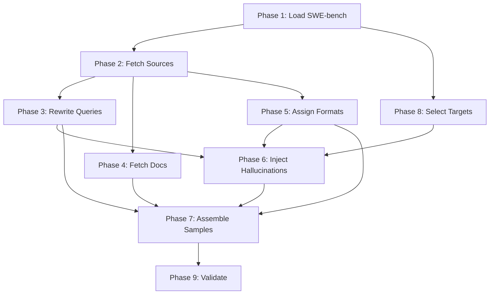

# Code Hallucination Dataset Pipeline

A modular 9-phase pipeline for generating span-level code hallucination detection datasets from [SWE-bench](https://www.swebench.com/). Produces training data where each sample contains source code context, a code answer, and character-level annotations marking hallucinated spans.

## Why This Dataset?

Existing hallucination detection datasets (RAGTruth, RAGBench) focus on **text** — question answering, summarization, data-to-text. There is no established **span-level code hallucination dataset**. CodeMirage classifies entire snippets but doesn't localize where the hallucination is.

This pipeline generates samples where an LLM coding assistant answers a developer's question about a real codebase, and we know exactly which character spans in the answer are hallucinated — enabling training of both token-level classifiers (ModernBERT) and generative span detectors (decoder LLMs).

## Dataset Overview

| Property | Value |
|----------|-------|
| **Source** | SWE-bench (all splits) |
| **Total instances** | ~21,500 (19k train + 225 dev + 2.3k test) |
| **Repos** | 53 unique repos, zero overlap between splits |
| **Clean/hallucinated ratio** | ~60% clean / ~40% hallucinated |
| **Hallucination types** | Structural, behavioral, semantic |
| **Answer formats** | Code with explanation, complete function, fragment, edit-style |
| **Annotation granularity** | Character-level spans |

## Quick Start

### Test with a few examples

```bash
# Using Groq (fast, free tier available)
OPENAI_API_KEY=your_groq_key \
  python -m scripts.code_hallucination.pipeline --test 5

# Using any OpenAI-compatible API
OPENAI_API_KEY=your_key \
API_BASE_URL=https://api.example.com/v1 \
MODEL=your-model-name \
  python -m scripts.code_hallucination.pipeline --test 10
```

### Run the full pipeline

```bash
# Run all 9 phases
python -m scripts.code_hallucination.pipeline --all

# Run specific phases
python -m scripts.code_hallucination.pipeline --phase 1 2 3

# Override LLM settings via CLI
python -m scripts.code_hallucination.pipeline --all \
  --api-key YOUR_KEY \
  --base-url https://api.groq.com/openai/v1 \
  --model moonshotai/kimi-k2-instruct-0905
```

### Run with local vLLM (recommended for bulk generation)

```bash
# Terminal 1: Start vLLM
vllm serve Qwen/Qwen3.5-2B --port 8000

# Terminal 2: Run pipeline with batch processing
BATCH_SIZE=16 \
API_BASE_URL=http://localhost:8000/v1 \
OPENAI_API_KEY=dummy \
MODEL=Qwen/Qwen3.5-2B \
  python -m scripts.code_hallucination.pipeline --all
```

`BATCH_SIZE>1` enables async concurrent requests — no rate limiting, full GPU saturation.

### CLI Options

| Flag | Description |
|------|-------------|
| `--test N` | Test mode: run pipeline on N random test instances using GitHub API (no repo cloning) |
| `--all` | Run all 9 phases |
| `--phase 1 2 3` | Run specific phases (1-9) |
| `--api-key` | LLM API key (or set `OPENAI_API_KEY` env var) |
| `--base-url` | LLM API base URL (or set `API_BASE_URL` env var) |
| `--model` | LLM model name (or set `MODEL` env var) |

| Environment Variable | Description |
|---------------------|-------------|
| `BATCH_SIZE` | Number of concurrent requests (default: 1). Set >1 for local vLLM |
| `OPENAI_API_KEY` | API key for the LLM provider |
| `API_BASE_URL` | OpenAI-compatible API endpoint |
| `MODEL` | Model name |
| `CONTEXT7_API_KEY` | API key for Context7 documentation service |

## Pipeline Architecture



Phases 3 and 4 can run in parallel. Phase 8 (target selection) runs before Phase 6 (injection).

## Output Format

Each sample follows the `HallucinationSample` format used by LettuceDetect:

```json
{
  "prompt": "File: django/http/response.py\n```python\n...\n```\n\nUser request: How do I fix the Content-Type header issue?",
  "answer": "def fix_content_type(self):\n    self.headers['Content-Type'] = response.get_type()\n    ...",
  "labels": [
    {"start": 55, "end": 75, "label": "structural"}
  ],
  "split": "test",
  "task_type": "code_generation",
  "dataset": "swebench_code",
  "language": "en"
}
```

- **`prompt`**: Source code files + documentation + user query
- **`answer`**: Code in one of four formats (code with explanation, complete function, fragment, edit-style)
- **`labels`**: Character-level span annotations (empty for clean samples)
- **`split`**: train/dev/test (inherited from SWE-bench, zero repo overlap)

## Supported LLM Providers

The pipeline works with any OpenAI-compatible API. Tested with:

| Provider | Model | Notes |
|----------|-------|-------|
| [Groq](https://groq.com) | `openai/gpt-oss-120b` | Best quality, recommended |
| [Groq](https://groq.com) | `moonshotai/kimi-k2-instruct-0905` | Fast |
| [Novita AI](https://novita.ai) | `qwen/qwen3.5-27b` | Good for bulk generation |
| Local (vLLM/Ollama) | Any model | Free, best for large runs |

## Directory Structure

```
scripts/code_hallucination/
├── __init__.py              # Package declaration
├── pipeline.py              # CLI orchestrator
├── config.py                # Constants, paths, API settings
├── swebench_loader.py       # Phase 1: Load SWE-bench instances
├── source_fetcher.py        # Phase 2: Clone repos, fetch source files
├── query_rewriter.py        # Phase 3: LLM query rewriting
├── context7_docs.py         # Phase 4: Fetch library documentation
├── format_builder.py        # Phase 5: Assign answer formats
├── hallucination_injector.py # Phase 6: LLM hallucination injection
├── sample_assembler.py      # Phase 7: Assemble final samples
├── splitter.py              # Phase 8: Select hallucination targets
└── validator.py             # Phase 9: Quality validation
```

Output data:

```
data/code_hallucination/
├── swebench_instances.json          # Phase 1 output
├── repos/                           # Phase 2: cloned repos (bare)
├── source_cache/                    # Phase 2: per-instance source data
│   └── {instance_id}.json
├── queries.jsonl                    # Phase 3 output
├── documentation.jsonl              # Phase 4 output
├── formats.jsonl                    # Phase 5 output
├── hallucinated_samples.jsonl       # Phase 6 output
├── code_hallucination_data.json     # Phase 7: final dataset
├── code_hallucination_metadata.json # Phase 7: metadata
└── validation_report.txt            # Phase 9 output
```

## Design Decisions

### One sample per instance
Each SWE-bench instance produces exactly one sample — either clean (gold patch answer) or hallucinated (LLM-injected). No instance appears in both classes. This avoids the artificial pairing problem where models learn to distinguish the specific instance rather than the hallucination.

### JSON-based span annotations
Hallucination spans are extracted from the LLM's structured JSON response, not from difflib character-level diffs. The LLM returns `{"hallucinated_code": "...", "changes": [{"original": "...", "hallucinated": "..."}]}` and spans are found by string matching. Quality controls enforce 2-3 spans per sample (avg 2.8), minimum 15 chars per span, and total coverage under 60%.

### 20% documentation split
A subset of instances (20%) include Context7 library documentation, filtered to only the repo's primary library. Documentation is also passed to the hallucination injector, enabling semantic hallucinations that contradict documented API behavior.

### Zero repo overlap between splits
SWE-bench's train/dev/test splits naturally have zero repository overlap across 53 unique repos. This means test performance measures generalization to completely unseen codebases.

## Training on This Dataset

Once you've generated the dataset, there are two training approaches. See [Architecture Research](architecture-research.md) for the full rationale behind each.

### Approach A: Token Classification (ModernBERT)

The standard LettuceDetect approach — a lightweight encoder that labels each token as supported or hallucinated.

```bash
# Code data only
python scripts/train_code_hallucination.py \
    --code-data-path data/code_hallucination/code_hallucination_data.json \
    --model-name answerdotai/ModernBERT-base \
    --output-dir output/code_hallucination_detector \
    --batch-size 4 \
    --epochs 6 \
    --learning-rate 1e-5

# Code + RAGTruth combined (better generalization across text and code)
python scripts/train_code_hallucination.py \
    --code-data-path data/code_hallucination/code_hallucination_data.json \
    --ragtruth-path data/ragtruth/ragtruth_data.json \
    --model-name answerdotai/ModernBERT-base \
    --output-dir output/code_hallucination_detector \
    --batch-size 4 \
    --epochs 6
```

The training script uses SWE-bench splits directly — train for training, dev for validation, test held out. Zero repository overlap between splits.

### Approach D: Generative Span Detection (Qwen SFT)

Fine-tune a decoder LLM to read context + answer and generate a JSON list of hallucinated spans with explanations. This is the reverse of the injection pipeline.

```bash
# Requires: pip install peft
python scripts/train_generative_detector.py \
    --code-data-path data/code_hallucination/code_hallucination_data.json \
    --model-name Qwen/Qwen3.5-2B \
    --output-dir output/generative_detector \
    --batch-size 2 \
    --epochs 3 \
    --lora-r 16
```

The model learns to output:

```json
{"hallucinated_spans": [{"text": "response.json_decode()", "explanation": "method is json(), not json_decode()"}]}
```

For clean samples it outputs `{"hallucinated_spans": []}`.

Training uses [LoRA](https://arxiv.org/abs/2106.09685) for memory efficiency (~5-8GB VRAM). Only the model's response tokens contribute to the loss — context and prompt tokens are masked.

| Parameter | Default | Description |
|-----------|---------|-------------|
| `--model-name` | `Qwen/Qwen3.5-2B` | Any HuggingFace causal LM |
| `--lora-r` | 16 | LoRA rank (higher = more capacity, more memory) |
| `--lora-alpha` | 32 | LoRA scaling factor |
| `--batch-size` | 2 | Training batch size |
| `--epochs` | 3 | Number of training epochs |
| `--learning-rate` | 2e-4 | Learning rate |
| `--gradient-accumulation-steps` | 4 | Accumulate gradients over N steps (simulates larger batch) |

### Evaluate

```bash
python scripts/evaluate_code_hallucination.py \
    --model_path output/code_hallucination_detector \
    --data_path data/code_hallucination/code_hallucination_data.json \
    --evaluation_type example_level
```

## End-to-End Example

```bash
# 1. Generate dataset (local vLLM for speed)
vllm serve Qwen/Qwen3.5-2B --port 8000  # in another terminal

BATCH_SIZE=16 \
API_BASE_URL=http://localhost:8000/v1 \
OPENAI_API_KEY=dummy \
MODEL=Qwen/Qwen3.5-2B \
  python -m scripts.code_hallucination.pipeline --all

# 2. Train
python scripts/train_code_hallucination.py \
    --code-data-path data/code_hallucination/code_hallucination_data.json \
    --model-name answerdotai/ModernBERT-base \
    --output-dir output/code_hallucination_detector \
    --batch-size 4 --epochs 6

# 3. Evaluate
python scripts/evaluate_code_hallucination.py \
    --model_path output/code_hallucination_detector \
    --data_path data/code_hallucination/code_hallucination_data.json \
    --evaluation_type example_level
```

The pipeline is **fully resumable** — every slow phase saves results incrementally to JSONL. If it crashes, re-run the same command and it picks up where it left off.
